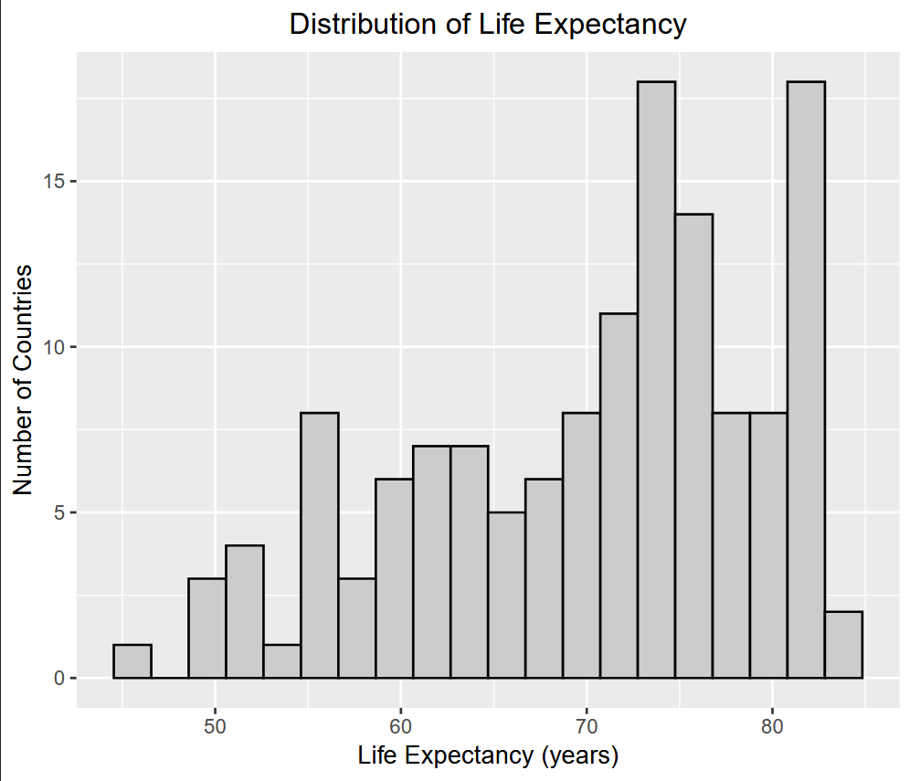
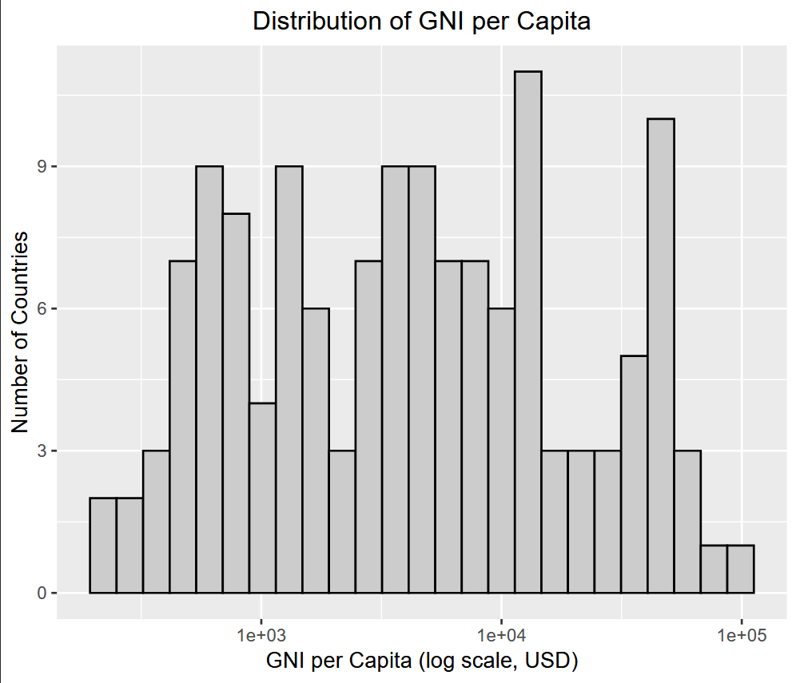
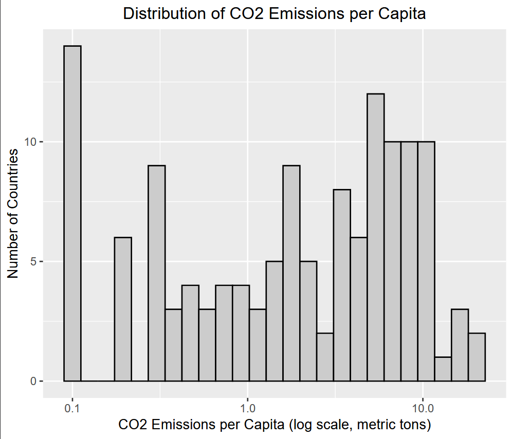
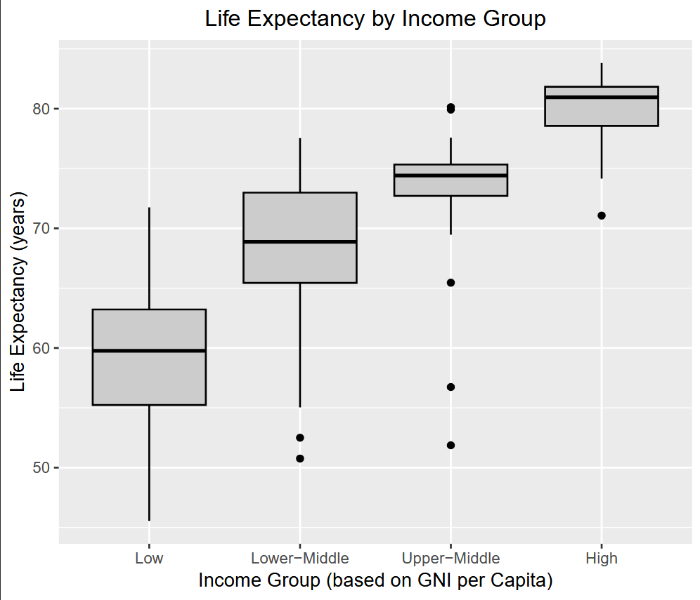
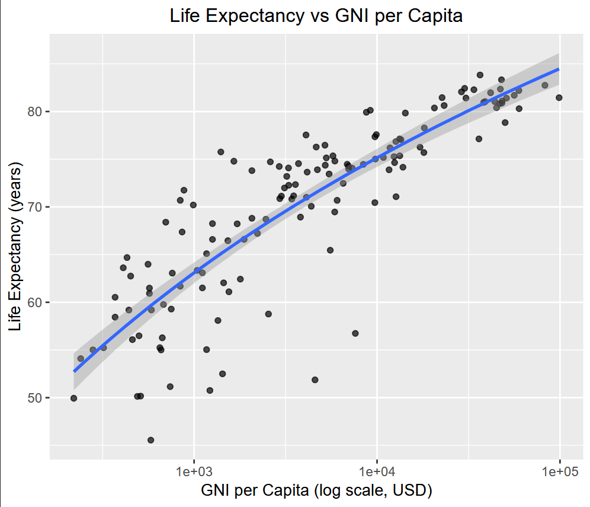
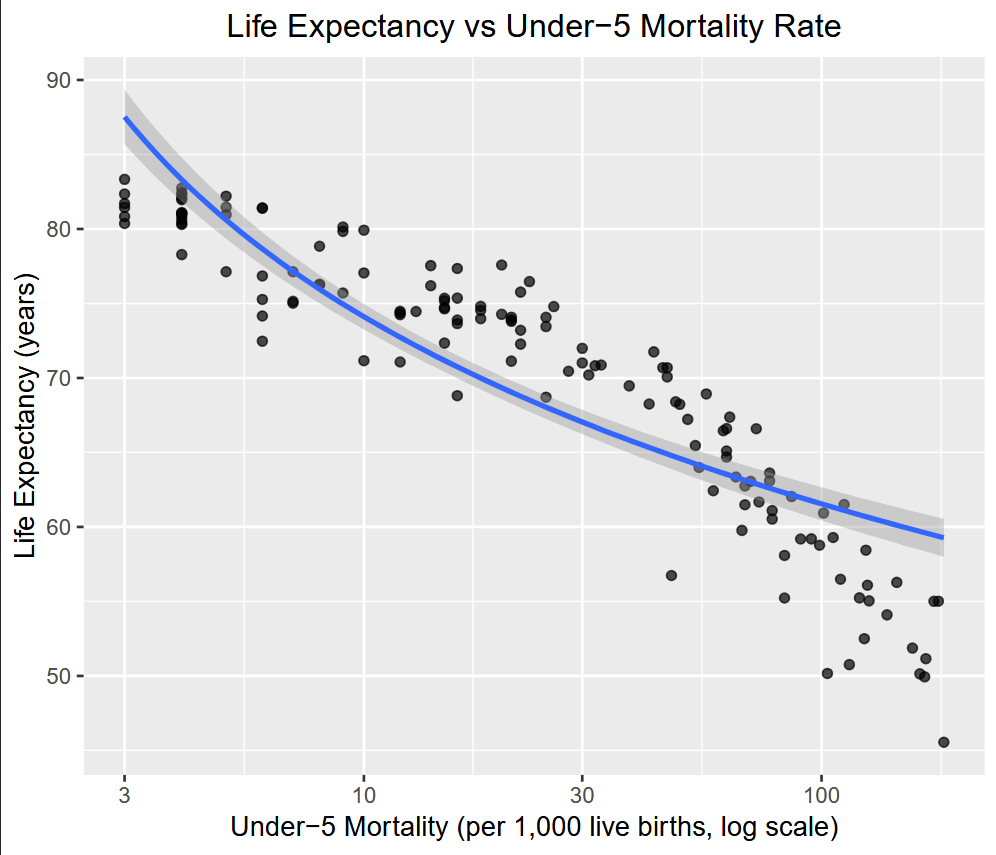
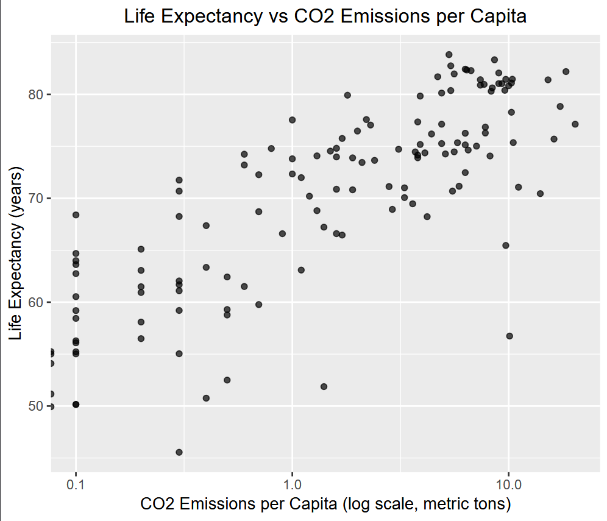
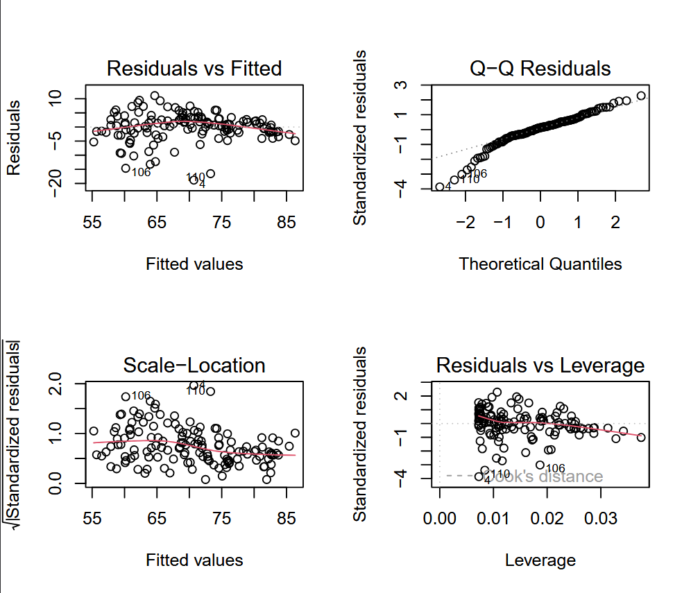
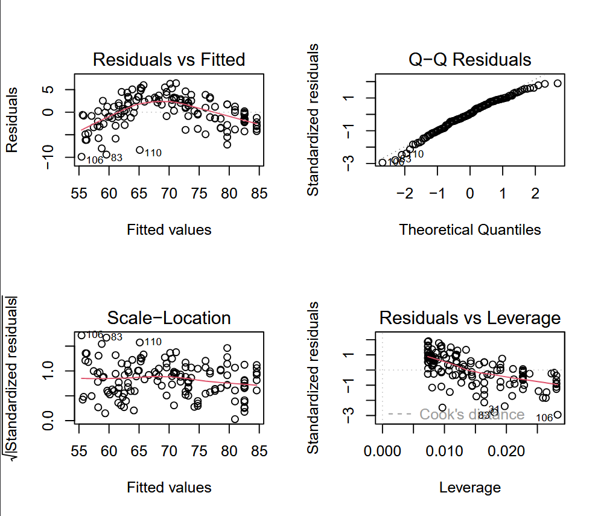
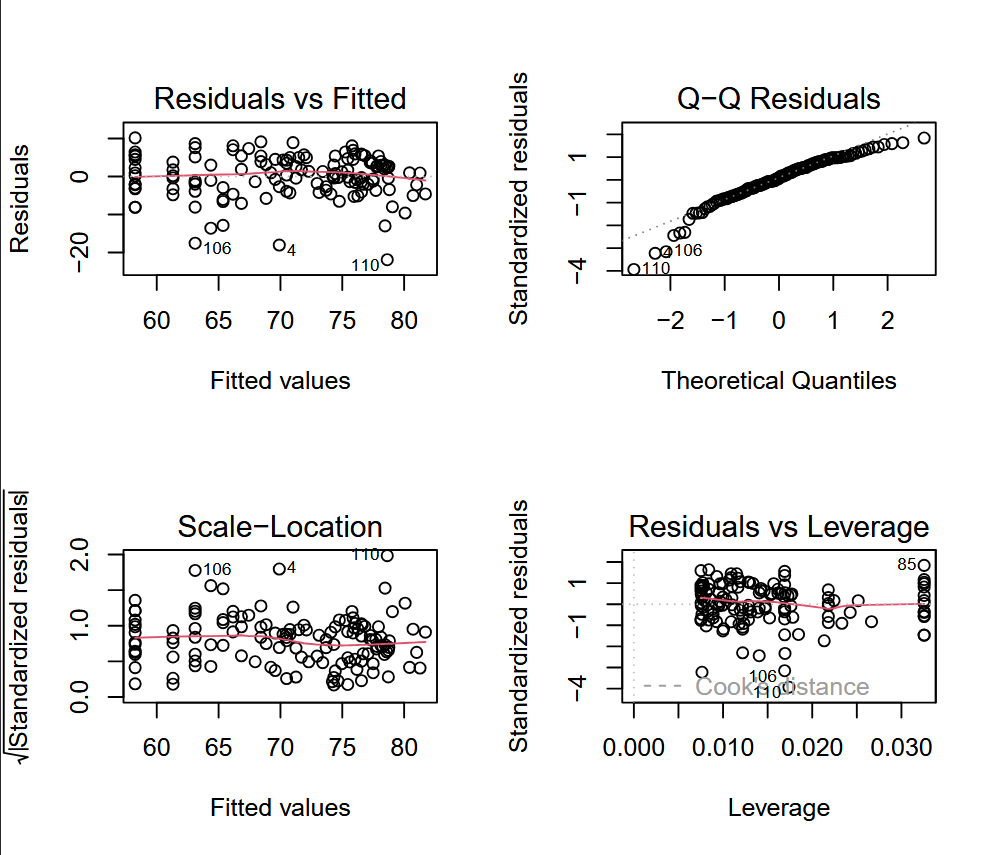

Assessing Gross National Income, Under-5 Mortality Rates, and CO2 Emissions as Predictors for Life Expectancy Across the World

STAT 656: Statistical Computing

Krisitna Aggas

**1\. Introduction**

Life expectancy is an important measure of population health because it summarizes the overall impact of mortality risk in one number. Research shows that economic development, child health, and environmental conditions are key determinants of life expectancy across countries.

Studies have found that the relationship between life expectancy and factors such as Gross National Income (GNI), child health (under-5 mortality), and environmental conditions, such as CO2 emissions, is not always straightforward. After a certain point, increases in these factors lead to smaller gains in life expectancy.

This study contributes to prior research by examining how national income, child health, and environmental factors relate to life expectancy across countries. Using cross-sectional data from the World Bank, it examines whether the link between income and health shows diminishing returns. It also looks at how well under-5 mortality predicts life expectancy and considers the environmental effects of industrial development.

**2\. Background / Literature Review**

The relationship between a country's per-capita income and life expectancy was first described by Samuel H. Preston in 1975\. The Preston Curve indicates that, on average, individuals living in wealthier countries live longer than those living in poorer countries (Preston, 1975). This is a nonlinear relationship, showing that while there are significant jumps in life expectancy when per-capita income is low, smaller increases occur when per-capita income is already high. A 2013 study examined the relationship between upward shifts in life expectancy in Europe and national income in the latter part of the 20th century and found that life expectancy growth depends on a country's economic growth (Mackenbach & Looman, 2013).

The Under-5 Mortality rate has been used both as a general measure of population health and as an indicator of a country's healthcare quality. Access to healthcare can include preventive measures and enable early diagnosis and treatment that might otherwise go unnoticed. In 2010, of the 2.3 million childhood deaths in children under 5, 33% occurred in South Asia, 49.6% occurred in Sub-Saharan Africa, while just 1% occurred in developed countries (Rajaratnam et al, 2010).

Finally, environmental factors can significantly affect life expectancy. Studies have shown a relationship between environmental quality and social equality. In areas where people are more disadvantaged, environmental quality tends to be lower; water and air quality are two measures with more immediate implications (Cushing et al., 2015). CO2 emissions are among the variables considered when assessing air quality. In 2024, a study found that a 1% increase in CO2 emissions is associated with a 0.15% decrease in life expectancy.

**3\. Research Questions**

Using data from the World Bank, this paper aims to answer the following questions:

* Is the relationship between GNI and life expectancy linear, or does it plateau?  
* How strongly is under-5 mortality associated with life expectancy?  
* Do environmental factors (CO2 emissions) relate to life expectancy after accounting for income?

**4\. Data**

The data used in this paper comes from the World Bank World Development Indicators. The analysis uses cross-sectional life expectancy data from 138 countries collected in 2013\. The following variables were utilized as part of the analysis:

* Life expectancy (life\_exp)  
* GNI-A per capita (gni\_pc)  
* Under-5 mortality (u5\_mort)  
* CO2 emissions per capita (co2\_pc)

A few data points were initially missing under GNA-A. These data points were obtained from the World Bank’s website and completed. The Under-5 Mortality statistic was unavailable for Hong Kong and left blank. This has been noted as NA in the final data.

**5\. Descriptive Statistics**

Table 1 presents summary statistics for life expectancy, GNI per capita, under-5 mortality, and CO2 emissions per capita. GNI per capita and under-5 mortality both vary widely and are not evenly distributed. Figure 1 shows the distribution of life expectancy, Figures 2-4 show the distributions of the independent variables, and Figure 5 shows life expectancy by income group.

| Table 1 \- Summary Statistics |  |  |  |  |
| ----- | :---- | :---- | :---- | :---- |
|  | Life Expectancy | GNI | Under 5 Mortality | CO2 Emissions |
| Minimum | 45.55 | 220 | 3.00 | 0.00 |
| 1st Qaurtile | 63.07 | 1125 | 8.00 | 0.40 |
| Median | 72.41 | 4100 | 22.00 | 1.95 |
| Mean | 70.13 | 12024 | 44.48 | 3.85 |
| 3rd Quartile | 77.00 | 12692 | 68.00 | 6.30 |
| Maximum | 83.83 | 98860 | 185.00 | 20.30 |
| Standard Deviation | 9.33 | 18023.07 | 46.96 | 4.30 |

**Figure 1**

**Figure 2**

**Figure 3**

**Figure 4**

**Figure 5**

Table 2 shows the correlation matrix for the independent and dependent variables. The data reveal significant differences between countries in economic, healthcare, and environmental factors. Life expectancy and under-5 mortality are strongly negatively correlated, whereas GNI and life expectancy are strongly positively correlated. There is also a moderate link between CO2 emissions and life expectancy. Figures 6-8 show these relationships before regression analysis.

**Figure 6**

**Figure 7**

**Figure 8**

| Table 2 \- Correlation Matrix |  |  |  |  |
| ----- | :---- | :---- | :---- | :---- |
|  | Life Expectancy | GNI | Under 5 Mortality | CO2 Emissions |
| Life Expectancy | 1.000 | 0.629 | \-0.932 | 0.609 |
| GNI | 0.629 | 1.000 | \-0.486 | 0.675 |
| Under 5 Mortality | \-0.932 | \-0.486 | 1.000 | \-0.568 |
| CO2 Emissions | 0.609 | 0.675 | \-0.568 | 1.000 |

**6\. Methodology**

This study employs cross-sectional regression analysis to examine how life expectancy is associated with socioeconomic and environmental factors across countries. Because these relationships may not be linear, the analysis includes square, square-root, inverse, and log transformations. First, individual regressions were run to identify the best functional form; then, a stepwise regression using the Akaike Information Criterion (AIC) was conducted. Lower AIC values mean a better model fit. Hierarchical rules were enforced for polynomial transformations, and diagnostic checks were done to test the final model. The analysis begins with income and life expectancy, then examines child health and environmental factors, and concludes with a multiple regression model.

**6.1 Income and Life Expectancy**

The first model used a simple regression of life expectancy on GNI per capita. Various transformations of GNI, including square, square root, inverse, and logarithmic, were tested and compared using the Akaike Information Criterion (AIC). The goal was to see if the income-health relationship is nonlinear and if life expectancy shows diminishing returns as income increases, as previous research suggests.

**6.2 Under-5 Mortality and Life Expectancy**

Next, life expectancy was modeled using under-5 mortality in a simple regression. Various transformations of under-5 mortality were tested to assess the strength and nature of the relationship between under-5 mortality and life expectancy.

**6.3 Environmental Factors (CO2 Emissions)**

Then, life expectancy was modeled as a function of CO2 emissions using a simple regression. Various transformations of CO2 emissions were tested to assess whether environmental factors, such as CO2 emissions, are associated with life expectancy after controlling for income. Because CO2 emissions are correlated with income and industrialization, their coefficient should be interpreted cautiously as an indirect indicator rather than a causal environmental effect

**6.4 Multiple Regression and Model Selection**

After examining each regression model separately, a multiple regression model was built to predict life expectancy using GNI, under-5 mortality, and CO2 emissions. This approach was used because life expectancy has no single predictor. Various transformations, including square, square root, inverse, and logarithmic, were applied to all variables. For log transformations, values had to be greater than zero, and for the square root, they had to be zero or higher. If these conditions were not met, the value was marked as NA.

A stepwise selection using the Akaike Information Criterion (AIC) was then performed. AIC helps balance model fit and complexity by penalizing extra variables. Models were compared using this standard, and a variable was kept only if it lowered the AIC value. Hierarchical rules were also used for polynomial factors. If the AIC selected a square or square-root transformation, the original variable was also included in the final model.

**6.5 Diagnostics and Multicollinearity**

Standard regression diagnostics were used to assess model assumptions, including residual diagnostics, QQ plots, scale-location plots, and leverage diagnostics. These tests checked for linearity, normality, error variance, and influential points. No significant problems were found. Residuals for GNI, under-5 mortality, CO2 emissions, and the multiple regression model are shown in Figures 9-12. The Variance Inflation Factor was also assessed to determine whether the variables were highly correlated.

**Figure 9 \- GNI Residuals**

**Figure 10 \- Under 5 Mortality Residuals**   

**Figure 11 \- CO2 Residuals**

**Figure 12 \- Multiple Regression Residuals**

## **7\. Regression Results**

### The simple regression results showed significant differences in how life expectancy relates to the different variables. Under-5 mortality had a strong negative relationship, explaining over 90% of the variation when used alone (Table 3-4). The square-root transformation gave the best fit, showing that the relationship is highly nonlinear (Table 5).

| Table 3 |  |  |
| ----- | ----- | ----- |
| **Model Specification** | **Degrees of Freedom** | **AIC** |
| Raw Under-5 Mortality | 3 | 725.57 |
| Log(Under-5 Mortality) | 3 | 727.88 |
| **Square Root Under-5 Mortality** | **3** | **656.90** |
| Squared Under-5 Mortality | 3 | 853.34 |
| Inverse Under-5 Mortality | 3 | 892.24 |

| Table 4 |  |  |  |  |
| ----- | ----- | ----- | ----- | ----- |
| **Variable** | **Estimate** | **Std. Error** | **t-value** | **p-value** |
| Intercept | 85.432 | 0.448 | 190.50 | \< 0.001 |
| √(Under-5 Mortality) | −2.665 | 0.067 | −39.64 | \< 0.001 |

| Table 5 |  |
| ----- | ----- |
| **Statistic** | **Value** |
| Observations (N) | 136 |
| Residual Std. Error | 2.622 |
| R² | 0.921 |
| Adjusted R² | 0.920 |
| F-statistic | 1571 |
| Model p-value | \< 0.001 |

Gross National Income was positively associated with life expectancy, but this association was weaker than that with under-5 mortality. GNI explained 72% of the variation, and the logarithmic transformation was the best predictor (Tables 6-8). This matches the idea of diminishing returns to income at higher income levels, as shown by the Preston Curve.

| Table 6 |  |  |  |  |
| ----- | ----- | ----- | ----- | ----- |
| **Variable** | **Estimate** | **Std. Error** | **t-value** | **p-value** |
| Intercept | 27.797 | 2.262 | 12.29 | \< 0.001 |
| Log(GNI per Capita) | 5.089 | 0.267 | 19.04 | \< 0.001 |

| Table 7 |  |
| ----- | ----- |
| **Statistic** | **Value** |
| Observations (N) | 138 |
| Residual Std. Error | 4.890 |
| R² | 0.727 |
| Adjusted R² | 0.725 |
| F-statistic | 362.5 |
| Model p-value | \< 0.001 |

| Table 8 |  |  |
| ----- | ----- | ----- |
| **Model Specification** | **Degrees of Freedom** | **AIC** |
| Raw GNI per Capita | 3 | 941.91 |
| **Log(GNI per Capita)** | **3** | **833.67** |
| Square Root GNI per Capita | 3 | 893.66 |
| Squared GNI per Capita | 3 | 982.87 |
| Inverse GNI per Capita | 3 | 901.11 |

CO2 emissions had the weakest association with life expectancy, accounting for just over 60% of the variance (Table 9-10). The logarithmic transformation gave the best fit (Table 11). However, this relationship is not precise, suggesting that CO2 emissions may reflect other industrialization-related factors rather than being a direct cause.

| Table 9 |  |  |  |  |
| ----- | ----- | ----- | ----- | ----- |
|  |  |  |  |  |
| **Variable** | **Estimate** | **Std. Error** | **t-value** | **p-value** |
| Intercept | 68.421 | 0.514 | 133.00 | \< 0.001 |
| Log(CO2 Emissions per Capita) | 4.417 | 0.313 | 14.10 | \< 0.001 |

| Table 10 |  |
| ----- | ----- |
| **Statistic** | **Value** |
| Observations (N) | 133 |
| Residual Std. Error | 5.612 |
| R² | 0.603 |
| Adjusted R² | 0.600 |
| F-statistic | 198.9 |
| Model p-value | \< 0.001 |

| Table 11 |  |  |
| ----- | ----- | ----- |
| **Model Specification** | **Degrees of Freedom** | **AIC** |
| Raw CO2 Emissions per Capita | 3 | 949.26 |
| **Log(CO2 Emissions per Capita)** | **3** | **840.27** |
| Square Root CO2 Emissions per Capita | 3 | 904.84 |
| Squared CO2 Emissions per Capita | 3 | 989.02 |
| Inverse CO2 Emissions per Capita | 3 | 886.55 |

The final regression tests whether the relationships identified in the simple regressions remain valid when all three factors are included simultaneously. The multiple regression model explains more than 90% of the variance. The final model includes both the original and squared forms of GNI and under-5 mortality, as well as the original CO2 variable. Under-5 mortality and GNI still exhibit nonlinear relationships. When controlling for income and child mortality, CO2 emissions are negatively associated with life expectancy. This pattern is consistent with the interpretation of CO2 emissions as a proxy for industrialization or other unobserved factors rather than a direct determinant of health outcomes (Table 12-14). VIF scores ranged from 11.14 to 17.19, except for CO2 emissions, which had a VIF of 2.57.

| Table 12 |  |  |  |  |
| ----- | ----- | ----- | ----- | ----- |
| **Variable** | **Estimate** | **Std. Error** | **t-value** | **p-value** |
| Intercept | 77.77 | 0.735 | 105.80 | \< 0.001 |
| GNI per Capita (raw) | 0.000237 | 0.000048 | 4.91 | \< 0.001 |
| GNI per Capita (squared) | −1.77e−09 | 5.59e−10 | −3.17 | 0.002 |
| Under-5 Mortality (raw) | −0.246 | 0.020 | −12.29 | \< 0.001 |
| Under-5 Mortality (squared) | 0.000507 | 0.000118 | 4.29 | \< 0.001 |
| CO2 Emissions per Capita (raw) | −0.246 | 0.078 | −3.14 | 0.002 |

| Table 13 |  |
| ----- | ----- |
| **Statistic** | **Value** |
| Observations (N) | 132 |
| Residual Std. Error | 2.417 |
| R² | 0.928 |
| Adjusted R² | 0.925 |
| F-statistic | 324.5 |
| Model p-value | \< 0.001 |

| Table 14 |  |
| ----- | ----- |
| **Variable** | **VIF** |
| GNI per Capita (raw) | 17.19 |
| GNI per Capita (squared) | 11.14 |
| Under-5 Mortality (raw) | 16.06 |
| Under-5 Mortality (squared) | 12.31 |
| CO2 Emissions per Capita (raw) | 2.57 |

**8\. Discussion**

In the simple regression for GNI-A, the log transformation yielded the best fit, accounting for approximately 80% of the variance. This pattern aligns with the Preston Curve, in which life expectancy rises with income but the gains slow after a certain point. Among the three variables, under-5 mortality was the strongest predictor, accounting for 92.1% of the variance. This matches earlier studies and may reflect factors such as access to clean water, healthcare, nutrition, education, and sanitation. The square-root transformation of under-5 mortality performed best, helping to even out differences when rates vary substantially across countries. The simple linear model for CO2 emissions was the weakest, accounting for approximately 60% of the variance. On its own, the model suggests that higher CO2 emissions are linked to higher life expectancy. Like GNI, the best-fit model for CO2 used a log transformation, indicating diminishing returns as CO2 increases.

The final multiple regression model included both the original and squared forms of GNI and under-5 mortality, as well as the original CO2 variable. Together, these explained 92.5% of the variance in life expectancy, which is not much higher than using under-5 mortality alone. This shows that under-5 mortality is a strong predictor. In a multiple regression, holding GNI and under-5 mortality constant, CO2 emissions have a negative effect on life expectancy. This supports the idea that CO2 serves as a proxy for industrialization, which is linked to higher life expectancy. Although VIF scores were high for four variables, the AIC selection method and the low VIF for CO2 emissions alone led to their retention, likely because the original and squared variables are correlated.

**9\. Limitations**

There are several limitations to this study. It uses a cross-sectional design, which means it only examines one point in time. Results may differ if data from other years were used. Some variables, such as the homicide rate and adult literacy rate, were not included and could affect life expectancy. Mistakes in measurement or reporting could also have influenced the results.

It is important to note that these results do not prove causality. More research is needed to confirm any cause-and-effect relationships.

**10\. Conclusion**

This study looked at how well gross national income, under-5 mortality, and CO2 emissions predict life expectancy. Gross national income per capita was logarithmically related to life expectancy, consistent with the Preston Curve. Under-5 mortality was the strongest predictor, comparable to the multiple regression model. In simple regressions, CO2 emissions were positively associated with life expectancy, likely reflecting higher industrial development rather than a direct health benefit. These results can help identify strategies to improve life expectancy in countries with low life expectancy.

## 

## 

## 

## 

## **References**

Cushing L, Morello-Frosch R, Wander M, Pastor M. The haves, the have-nots, and the health of everyone: the relationship between social inequality and environmental quality. Annu Rev Public Health. 2015 Mar 18;36:193-209. doi: 10.1146/annurev-publhealth-031914-122646. PMID: 25785890\.

Javanshirova, Z. (2024). The effect of Carbon Emissions on Life Expectancy: Evidence from Azerbaijan. *Journal of Sustainable Development Issues*, *2*(2), 67–75. https://doi.org/10.62433/josdi.v2i2.29

Mackenbach JP, Looman CW. Life expectancy and national income in Europe, 1900-2008: an update of Preston's analysis. Int J Epidemiol. 2013 Aug;42(4):1100-10. doi: 10.1093/ije/dyt122. Epub 2013 Aug 6\. PMID: 23920140\.

Preston, S. H. (1975). The Changing Relation between Mortality and Level of Economic Development. *Population Studies*, *29*(2), 231–248. [https://doi.org/10.2307/2173509](https://doi.org/10.2307/2173509)

Rajaratnam JK, Marcus JR, Flaxman AD, Wang H, Levin-Rector A, Dwyer L, Costa M, Lopez AD, Murray CJ. Neonatal, postneonatal, childhood, and under-5 mortality for 187 countries, 1970-2010: a systematic analysis of progress towards Millennium Development Goal 4\. Lancet. 2010 Jun 5;375(9730):1988-2008. doi: 10.1016/S0140-6736(10)60703-9. Epub 2010 May 27\. Erratum in: Lancet. 2010 Aug 28;376(9742):686. Erratum in: Lancet. 2010 Jun 19;375(9732):2142. PMID: 20546887\.

The World Bank. (2023). World development indicators \[Data file\]. https://databank.worldbank.org/source/world-development-indicators.  
(In-text: (The World Bank, 2023))

**Appendix**  
\> library(tidyverse)  
── Attaching core tidyverse packages ──────────────── tidyverse 2.0.0 ──  
✔ dplyr     1.1.4     ✔ readr     2.1.6  
✔ forcats   1.0.1     ✔ stringr   1.6.0  
✔ ggplot2   4.0.1     ✔ tibble    3.3.0  
✔ lubridate 1.9.4     ✔ tidyr     1.3.1  
✔ purrr     1.2.0       
── Conflicts ────────────────────────────────── tidyverse\_conflicts() ──  
✖ dplyr::filter() masks stats::filter()  
✖ dplyr::lag()    masks stats::lag()  
ℹ Use the conflicted package to force all conflicts to become errors  
\> library(car)  
Loading required package: carData

Attaching package: ‘car’

The following object is masked from ‘package:dplyr’:

    recode

The following object is masked from ‘package:purrr’:

    some  
\>   
\> \# \---- 1\) Load cross-sectional data \----  
\> dat \<- read.csv("life\_expectancy\_cross\_section.csv", stringsAsFactors \= FALSE)  
\>   
\> \# \---- 2\) Summary statistics and Correlations \----  
\> summary(dat\[, c("life\_exp", "gni\_pc", "u5\_mort", "co2\_pc")\])  
    life\_exp         gni\_pc         u5\_mort           co2\_pc       
 Min.   :45.55   Min.   :  220   Min.   :  3.00   Min.   : 0.00    
 1st Qu.:63.07   1st Qu.: 1125   1st Qu.:  8.00   1st Qu.: 0.40    
 Median :72.41   Median : 4100   Median : 22.00   Median : 1.95    
 Mean   :70.13   Mean   :12024   Mean   : 44.48   Mean   : 3.85    
 3rd Qu.:77.00   3rd Qu.:12692   3rd Qu.: 68.00   3rd Qu.: 6.30    
 Max.   :83.83   Max.   :98860   Max.   :185.00   Max.   :20.30    
                                 NA's   :1                         
\> sapply(dat\[, c("life\_exp", "gni\_pc", "u5\_mort", "co2\_pc")\], sd, na.rm \= TRUE)  
    life\_exp       gni\_pc      u5\_mort       co2\_pc   
    9.327825 18023.072873    46.957287     4.297873   
\>   
\> \# \---- Correlation matrix \----  
\> cor\_vars \<- dat %\>%  
\+   select(life\_exp, gni\_pc, u5\_mort, co2\_pc)  
\>   
\> cor\_matrix \<- cor(cor\_vars, use \= "complete.obs")  
\>   
\> round(cor\_matrix, 3\)  
         life\_exp gni\_pc u5\_mort co2\_pc  
life\_exp    1.000  0.629  \-0.932  0.609  
gni\_pc      0.629  1.000  \-0.486  0.675  
u5\_mort    \-0.932 \-0.486   1.000 \-0.568  
co2\_pc      0.609  0.675  \-0.568  1.000  
\>   
\> pairs(cor\_vars,  
\+       main \= "Scatterplot Matrix: Life Expectancy and Predictors")  
\>   
\> \# \---- 3\) Create transforms (raw/log/sqrt/sq/inv) \----  
\> dat \<- dat %\>%  
\+   mutate(  
\+     \# raw  
\+     gni\_raw \= gni\_pc, u5\_raw \= u5\_mort, co2\_raw \= co2\_pc,  
\+       
\+     \# log (requires \>0)  
\+     gni\_log \= ifelse(\!is.na(gni\_pc) & gni\_pc \> 0, log(gni\_pc), NA\_real\_),  
\+     u5\_log  \= ifelse(\!is.na(u5\_mort) & u5\_mort \> 0, log(u5\_mort), NA\_real\_),  
\+     co2\_log \= ifelse(\!is.na(co2\_pc) & co2\_pc \> 0, log(co2\_pc), NA\_real\_),  
\+       
\+     \# sqrt (requires \>=0)  
\+     gni\_sqrt \= ifelse(\!is.na(gni\_pc) & gni\_pc \>= 0, sqrt(gni\_pc), NA\_real\_),  
\+     u5\_sqrt  \= ifelse(\!is.na(u5\_mort) & u5\_mort \>= 0, sqrt(u5\_mort), NA\_real\_),  
\+     co2\_sqrt \= ifelse(\!is.na(co2\_pc) & co2\_pc \>= 0, sqrt(co2\_pc), NA\_real\_),  
\+       
\+     \# square  
\+     gni\_sq \= ifelse(\!is.na(gni\_pc), gni\_pc^2, NA\_real\_),  
\+     u5\_sq  \= ifelse(\!is.na(u5\_mort), u5\_mort^2, NA\_real\_),  
\+     co2\_sq \= ifelse(\!is.na(co2\_pc), co2\_pc^2, NA\_real\_),  
\+       
\+     \# inverse (requires \>0)  
\+     gni\_inv \= ifelse(\!is.na(gni\_pc) & gni\_pc \> 0, 1 / gni\_pc, NA\_real\_),  
\+     u5\_inv  \= ifelse(\!is.na(u5\_mort) & u5\_mort \> 0, 1 / u5\_mort, NA\_real\_),  
\+     co2\_inv \= ifelse(\!is.na(co2\_pc) & co2\_pc \> 0, 1 / co2\_pc, NA\_real\_)  
\+   )  
\>   
\> \# 4\) INDIVIDUAL REGRESSIONS  
\> \# Compare functional forms with AIC  
\>   
\> \# Under-5  
\> m\_u5\_raw  \<- lm(life\_exp \~ u5\_raw,  data \= dat)  
\> m\_u5\_log  \<- lm(life\_exp \~ u5\_log,  data \= dat)  
\> m\_u5\_sqrt \<- lm(life\_exp \~ u5\_sqrt, data \= dat)  
\> m\_u5\_sq   \<- lm(life\_exp \~ u5\_sq,   data \= dat)  
\> m\_u5\_inv  \<- lm(life\_exp \~ u5\_inv,  data \= dat)  
\>   
\> AIC(m\_u5\_raw, m\_u5\_log, m\_u5\_sqrt, m\_u5\_sq, m\_u5\_inv)  
          df      AIC  
m\_u5\_raw   3 725.5700  
m\_u5\_log   3 727.8844  
m\_u5\_sqrt  3 656.8961  
m\_u5\_sq    3 853.3365  
m\_u5\_inv   3 892.2376  
\> summary(m\_u5\_raw); summary(m\_u5\_log); summary(m\_u5\_sqrt); summary(m\_u5\_sq); summary(m\_u5\_inv)

Call:  
lm(formula \= life\_exp \~ u5\_raw, data \= dat)

Residuals:  
     Min       1Q   Median       3Q      Max   
\-12.8276  \-1.7822  \-0.2825   2.6871   9.9802 

Coefficients:  
             Estimate Std. Error t value Pr(\>|t|)      
(Intercept) 78.235250   0.397148  196.99   \<2e-16 \*\*\*  
u5\_raw      \-0.184419   0.006152  \-29.98   \<2e-16 \*\*\*  
\---  
Signif. codes:  0 ‘\*\*\*’ 0.001 ‘\*\*’ 0.01 ‘\*’ 0.05 ‘.’ 0.1 ‘ ’ 1

Residual standard error: 3.369 on 135 degrees of freedom  
  (1 observation deleted due to missingness)  
Multiple R-squared:  0.8694,    Adjusted R-squared:  0.8684   
F-statistic: 898.6 on 1 and 135 DF,  p-value: \< 2.2e-16

Call:  
lm(formula \= life\_exp \~ u5\_log, data \= dat)

Residuals:  
    Min      1Q  Median      3Q     Max   
\-9.8759 \-2.0516  0.2152  2.6398  6.4248 

Coefficients:  
            Estimate Std. Error t value Pr(\>|t|)      
(Intercept)  92.3367     0.8054  114.64   \<2e-16 \*\*\*  
u5\_log       \-7.0705     0.2382  \-29.69   \<2e-16 \*\*\*  
\---  
Signif. codes:  0 ‘\*\*\*’ 0.001 ‘\*\*’ 0.01 ‘\*’ 0.05 ‘.’ 0.1 ‘ ’ 1

Residual standard error: 3.397 on 135 degrees of freedom  
  (1 observation deleted due to missingness)  
Multiple R-squared:  0.8672,    Adjusted R-squared:  0.8662   
F-statistic: 881.3 on 1 and 135 DF,  p-value: \< 2.2e-16

Call:  
lm(formula \= life\_exp \~ u5\_sqrt, data \= dat)

Residuals:  
     Min       1Q   Median       3Q      Max   
\-10.4190  \-1.1579   0.2885   1.8455   5.3484 

Coefficients:  
            Estimate Std. Error t value Pr(\>|t|)      
(Intercept) 85.43238    0.44846  190.50   \<2e-16 \*\*\*  
u5\_sqrt     \-2.66545    0.06724  \-39.64   \<2e-16 \*\*\*  
\---  
Signif. codes:  0 ‘\*\*\*’ 0.001 ‘\*\*’ 0.01 ‘\*’ 0.05 ‘.’ 0.1 ‘ ’ 1

Residual standard error: 2.622 on 135 degrees of freedom  
  (1 observation deleted due to missingness)  
Multiple R-squared:  0.9209,    Adjusted R-squared:  0.9203   
F-statistic:  1571 on 1 and 135 DF,  p-value: \< 2.2e-16

Call:  
lm(formula \= life\_exp \~ u5\_sq, data \= dat)

Residuals:  
     Min       1Q   Median       3Q      Max   
\-15.2968  \-3.5396   0.0534   3.6914  13.8884 

Coefficients:  
              Estimate Std. Error t value Pr(\>|t|)      
(Intercept) 74.2980751  0.5267639  141.05   \<2e-16 \*\*\*  
u5\_sq       \-0.0010237  0.0000621  \-16.48   \<2e-16 \*\*\*  
\---  
Signif. codes:  0 ‘\*\*\*’ 0.001 ‘\*\*’ 0.01 ‘\*’ 0.05 ‘.’ 0.1 ‘ ’ 1

Residual standard error: 5.37 on 135 degrees of freedom  
  (1 observation deleted due to missingness)  
Multiple R-squared:  0.6681,    Adjusted R-squared:  0.6657   
F-statistic: 271.8 on 1 and 135 DF,  p-value: \< 2.2e-16

Call:  
lm(formula \= life\_exp \~ u5\_inv, data \= dat)

Residuals:  
     Min       1Q   Median       3Q      Max   
\-18.6432  \-3.6484   0.5818   5.1318  10.0477 

Coefficients:  
            Estimate Std. Error t value Pr(\>|t|)      
(Intercept)  63.7884     0.7123   89.56   \<2e-16 \*\*\*  
u5\_inv       74.8787     5.7225   13.09   \<2e-16 \*\*\*  
\---  
Signif. codes:  0 ‘\*\*\*’ 0.001 ‘\*\*’ 0.01 ‘\*’ 0.05 ‘.’ 0.1 ‘ ’ 1

Residual standard error: 6.19 on 135 degrees of freedom  
  (1 observation deleted due to missingness)  
Multiple R-squared:  0.5591,    Adjusted R-squared:  0.5559   
F-statistic: 171.2 on 1 and 135 DF,  p-value: \< 2.2e-16

\>   
\> \# GNI  
\> m\_gni\_raw  \<- lm(life\_exp \~ gni\_raw,  data \= dat)  
\> m\_gni\_log  \<- lm(life\_exp \~ gni\_log,  data \= dat)  
\> m\_gni\_sqrt \<- lm(life\_exp \~ gni\_sqrt, data \= dat)  
\> m\_gni\_sq   \<- lm(life\_exp \~ gni\_sq,   data \= dat)  
\> m\_gni\_inv  \<- lm(life\_exp \~ gni\_inv,  data \= dat)  
\>   
\> AIC(m\_gni\_raw, m\_gni\_log, m\_gni\_sqrt, m\_gni\_sq, m\_gni\_inv)  
           df      AIC  
m\_gni\_raw   3 941.9141  
m\_gni\_log   3 833.6659  
m\_gni\_sqrt  3 893.6648  
m\_gni\_sq    3 982.8662  
m\_gni\_inv   3 901.1086  
\> summary(m\_gni\_raw); summary(m\_gni\_log); summary(m\_gni\_sqrt); summary(m\_gni\_sq); summary(m\_gni\_inv)

Call:  
lm(formula \= life\_exp \~ gni\_raw, data \= dat)

Residuals:  
    Min      1Q  Median      3Q     Max   
\-20.826  \-4.551   1.830   5.637  10.928 

Coefficients:  
             Estimate Std. Error t value Pr(\>|t|)      
(Intercept) 6.619e+01  7.415e-01  89.258   \<2e-16 \*\*\*  
gni\_raw     3.283e-04  3.431e-05   9.567   \<2e-16 \*\*\*  
\---  
Signif. codes:  0 ‘\*\*\*’ 0.001 ‘\*\*’ 0.01 ‘\*’ 0.05 ‘.’ 0.1 ‘ ’ 1

Residual standard error: 7.238 on 136 degrees of freedom  
Multiple R-squared:  0.4023,    Adjusted R-squared:  0.3979   
F-statistic: 91.53 on 1 and 136 DF,  p-value: \< 2.2e-16

Call:  
lm(formula \= life\_exp \~ gni\_log, data \= dat)

Residuals:  
     Min       1Q   Median       3Q      Max   
\-18.8244  \-1.8859   0.6254   2.7716  11.0972 

Coefficients:  
            Estimate Std. Error t value Pr(\>|t|)      
(Intercept)  27.7969     2.2621   12.29   \<2e-16 \*\*\*  
gni\_log       5.0890     0.2673   19.04   \<2e-16 \*\*\*  
\---  
Signif. codes:  0 ‘\*\*\*’ 0.001 ‘\*\*’ 0.01 ‘\*’ 0.05 ‘.’ 0.1 ‘ ’ 1

Residual standard error: 4.89 on 136 degrees of freedom  
Multiple R-squared:  0.7272,    Adjusted R-squared:  0.7252   
F-statistic: 362.5 on 1 and 136 DF,  p-value: \< 2.2e-16

Call:  
lm(formula \= life\_exp \~ gni\_sqrt, data \= dat)

Residuals:  
    Min      1Q  Median      3Q     Max   
\-18.109  \-3.249   1.406   4.228  10.711 

Coefficients:  
             Estimate Std. Error t value Pr(\>|t|)      
(Intercept) 61.148357   0.836513   73.10   \<2e-16 \*\*\*  
gni\_sqrt     0.104255   0.007629   13.67   \<2e-16 \*\*\*  
\---  
Signif. codes:  0 ‘\*\*\*’ 0.001 ‘\*\*’ 0.01 ‘\*’ 0.05 ‘.’ 0.1 ‘ ’ 1

Residual standard error: 6.077 on 136 degrees of freedom  
Multiple R-squared:  0.5786,    Adjusted R-squared:  0.5755   
F-statistic: 186.8 on 1 and 136 DF,  p-value: \< 2.2e-16

Call:  
lm(formula \= life\_exp \~ gni\_sq, data \= dat)

Residuals:  
    Min      1Q  Median      3Q     Max   
\-23.028  \-6.075   2.533   6.123  11.272 

Coefficients:  
             Estimate Std. Error t value Pr(\>|t|)      
(Intercept) 6.858e+01  7.641e-01  89.749  \< 2e-16 \*\*\*  
gni\_sq      3.330e-09  5.787e-10   5.754 5.53e-08 \*\*\*  
\---  
Signif. codes:  0 ‘\*\*\*’ 0.001 ‘\*\*’ 0.01 ‘\*’ 0.05 ‘.’ 0.1 ‘ ’ 1

Residual standard error: 8.396 on 136 degrees of freedom  
Multiple R-squared:  0.1958,    Adjusted R-squared:  0.1899   
F-statistic: 33.11 on 1 and 136 DF,  p-value: 5.525e-08

Call:  
lm(formula \= life\_exp \~ gni\_inv, data \= dat)

Residuals:  
     Min       1Q   Median       3Q      Max   
\-21.7080  \-3.2299   0.6044   5.0719  11.7495 

Coefficients:  
              Estimate Std. Error t value Pr(\>|t|)      
(Intercept)    75.3049     0.6634  113.52   \<2e-16 \*\*\*  
gni\_inv     \-7909.0731   606.9347  \-13.03   \<2e-16 \*\*\*  
\---  
Signif. codes:  0 ‘\*\*\*’ 0.001 ‘\*\*’ 0.01 ‘\*’ 0.05 ‘.’ 0.1 ‘ ’ 1

Residual standard error: 6.243 on 136 degrees of freedom  
Multiple R-squared:  0.5553,    Adjusted R-squared:  0.552   
F-statistic: 169.8 on 1 and 136 DF,  p-value: \< 2.2e-16

\>   
\> \# CO2  
\> m\_co2\_raw  \<- lm(life\_exp \~ co2\_raw,  data \= dat)  
\> m\_co2\_log  \<- lm(life\_exp \~ co2\_log,  data \= dat)  
\> m\_co2\_sqrt \<- lm(life\_exp \~ co2\_sqrt, data \= dat)  
\> m\_co2\_sq   \<- lm(life\_exp \~ co2\_sq,   data \= dat)  
\> m\_co2\_inv  \<- lm(life\_exp \~ co2\_inv,  data \= dat)  
\>   
\> AIC(m\_co2\_raw, m\_co2\_log, m\_co2\_sqrt, m\_co2\_sq, m\_co2\_inv)  
           df      AIC  
m\_co2\_raw   3 949.2634  
m\_co2\_log   3 840.2692  
m\_co2\_sqrt  3 904.8383  
m\_co2\_sq    3 989.0167  
m\_co2\_inv   3 886.5549  
Warning message:  
In AIC.default(m\_co2\_raw, m\_co2\_log, m\_co2\_sqrt, m\_co2\_sq, m\_co2\_inv) :  
  models are not all fitted to the same number of observations  
\> summary(m\_co2\_raw); summary(m\_co2\_log); summary(m\_co2\_sqrt); summary(m\_co2\_sq); summary(m\_co2\_inv)

Call:  
lm(formula \= life\_exp \~ co2\_raw, data \= dat)

Residuals:  
    Min      1Q  Median      3Q     Max   
\-21.638  \-4.345   1.783   5.604  12.493 

Coefficients:  
            Estimate Std. Error t value Pr(\>|t|)      
(Intercept)  65.0522     0.8509  76.450  \< 2e-16 \*\*\*  
co2\_raw       1.3194     0.1478   8.929 2.63e-15 \*\*\*  
\---  
Signif. codes:  0 ‘\*\*\*’ 0.001 ‘\*\*’ 0.01 ‘\*’ 0.05 ‘.’ 0.1 ‘ ’ 1

Residual standard error: 7.433 on 136 degrees of freedom  
Multiple R-squared:  0.3696,    Adjusted R-squared:  0.3649   
F-statistic: 79.73 on 1 and 136 DF,  p-value: 2.632e-15

Call:  
lm(formula \= life\_exp \~ co2\_log, data \= dat)

Residuals:  
     Min       1Q   Median       3Q      Max   
\-21.8954  \-3.0214   0.3726   4.1484  10.1486 

Coefficients:  
            Estimate Std. Error t value Pr(\>|t|)      
(Intercept)  68.4214     0.5144   133.0   \<2e-16 \*\*\*  
co2\_log       4.4168     0.3132    14.1   \<2e-16 \*\*\*  
\---  
Signif. codes:  0 ‘\*\*\*’ 0.001 ‘\*\*’ 0.01 ‘\*’ 0.05 ‘.’ 0.1 ‘ ’ 1

Residual standard error: 5.612 on 131 degrees of freedom  
  (5 observations deleted due to missingness)  
Multiple R-squared:  0.6029,    Adjusted R-squared:  0.5998   
F-statistic: 198.9 on 1 and 131 DF,  p-value: \< 2.2e-16

Call:  
lm(formula \= life\_exp \~ co2\_sqrt, data \= dat)

Residuals:  
     Min       1Q   Median       3Q      Max   
\-23.0759  \-3.7152   0.7524   4.4451  11.5672 

Coefficients:  
            Estimate Std. Error t value Pr(\>|t|)      
(Intercept)  59.9781     0.9633   62.26   \<2e-16 \*\*\*  
co2\_sqrt      6.2421     0.4909   12.71   \<2e-16 \*\*\*  
\---  
Signif. codes:  0 ‘\*\*\*’ 0.001 ‘\*\*’ 0.01 ‘\*’ 0.05 ‘.’ 0.1 ‘ ’ 1

Residual standard error: 6.328 on 136 degrees of freedom  
Multiple R-squared:  0.5431,    Adjusted R-squared:  0.5397   
F-statistic: 161.7 on 1 and 136 DF,  p-value: \< 2.2e-16

Call:  
lm(formula \= life\_exp \~ co2\_sq, data \= dat)

Residuals:  
    Min      1Q  Median      3Q     Max   
\-22.685  \-6.558   2.269   6.370  13.989 

Coefficients:  
            Estimate Std. Error t value Pr(\>|t|)      
(Intercept) 68.22970    0.82139  83.066  \< 2e-16 \*\*\*  
co2\_sq       0.05737    0.01131   5.073 1.26e-06 \*\*\*  
\---  
Signif. codes:  0 ‘\*\*\*’ 0.001 ‘\*\*’ 0.01 ‘\*’ 0.05 ‘.’ 0.1 ‘ ’ 1

Residual standard error: 8.585 on 136 degrees of freedom  
Multiple R-squared:  0.1591,    Adjusted R-squared:  0.1529   
F-statistic: 25.73 on 1 and 136 DF,  p-value: 1.26e-06

Call:  
lm(formula \= life\_exp \~ co2\_inv, data \= dat)

Residuals:  
     Min       1Q   Median       3Q      Max   
\-22.4942  \-3.4167   0.8703   5.0072  13.1803 

Coefficients:  
            Estimate Std. Error t value Pr(\>|t|)      
(Intercept)  74.4565     0.6845   108.8   \<2e-16 \*\*\*  
co2\_inv      \-1.9237     0.1906   \-10.1   \<2e-16 \*\*\*  
\---  
Signif. codes:  0 ‘\*\*\*’ 0.001 ‘\*\*’ 0.01 ‘\*’ 0.05 ‘.’ 0.1 ‘ ’ 1

Residual standard error: 6.679 on 131 degrees of freedom  
  (5 observations deleted due to missingness)  
Multiple R-squared:  0.4376,    Adjusted R-squared:  0.4333   
F-statistic: 101.9 on 1 and 131 DF,  p-value: \< 2.2e-16

\>   
\> \# 5\) STEPWISE MULTIPLE REGRESSION   
\>   
\> step\_dat \<- dat %\>%  
\+   mutate(  
\+     \# re-assert transforms in case you edited earlier  
\+     gni\_raw  \= gni\_pc,  
\+     u5\_raw   \= u5\_mort,  
\+     co2\_raw  \= co2\_pc,  
\+       
\+     gni\_log  \= ifelse(gni\_pc  \> 0, log(gni\_pc),  NA\_real\_),  
\+     u5\_log   \= ifelse(u5\_mort \> 0, log(u5\_mort), NA\_real\_),  
\+     co2\_log  \= ifelse(co2\_pc  \> 0, log(co2\_pc),  NA\_real\_),  
\+       
\+     gni\_sqrt \= ifelse(gni\_pc  \>= 0, sqrt(gni\_pc),  NA\_real\_),  
\+     u5\_sqrt  \= ifelse(u5\_mort \>= 0, sqrt(u5\_mort), NA\_real\_),  
\+     co2\_sqrt \= ifelse(co2\_pc  \>= 0, sqrt(co2\_pc),  NA\_real\_),  
\+       
\+     gni\_sq   \= gni\_pc^2,  
\+     u5\_sq    \= u5\_mort^2,  
\+     co2\_sq   \= co2\_pc^2,  
\+       
\+     gni\_inv  \= ifelse(gni\_pc  \> 0, 1 / gni\_pc,  NA\_real\_),  
\+     u5\_inv   \= ifelse(u5\_mort \> 0, 1 / u5\_mort, NA\_real\_),  
\+     co2\_inv  \= ifelse(co2\_pc  \> 0, 1 / co2\_pc,  NA\_real\_)  
\+   ) %\>%  
\+     
\+   filter(  
\+     complete.cases(  
\+       life\_exp,  
\+       gni\_raw, gni\_log, gni\_inv, gni\_sqrt, gni\_sq,  
\+       u5\_raw,  u5\_log,  u5\_inv,  u5\_sqrt,  u5\_sq,  
\+       co2\_raw, co2\_log, co2\_inv, co2\_sqrt, co2\_sq  
\+     )  
\+   )  
\>   
\> nrow(step\_dat)  
\[1\] 132  
\>   
\> m\_null \<- lm(life\_exp \~ 1, data \= step\_dat)  
\>   
\> m\_upper \<- lm(  
\+   life\_exp \~  
\+     gni\_raw \+ gni\_log \+ gni\_inv \+ gni\_sqrt \+ gni\_sq \+  
\+     u5\_raw  \+ u5\_log  \+ u5\_inv  \+ u5\_sqrt  \+ u5\_sq  \+  
\+     co2\_raw \+ co2\_log \+ co2\_inv \+ co2\_sqrt \+ co2\_sq,  
\+   data \= step\_dat  
\+ )  
\>   
\> m\_step0 \<- step(  
\+   m\_null,  
\+   scope \= list(lower \= m\_null, upper \= m\_upper),  
\+   direction \= "both",  
\+   trace \= TRUE  
\+ )  
Start:  AIC=576.09  
life\_exp \~ 1

           Df Sum of Sq     RSS    AIC  
\+ u5\_sqrt   1    9317.5   901.1 257.55  
\+ u5\_raw    1    8821.4  1397.2 315.44  
\+ u5\_log    1    8753.9  1464.7 321.67  
\+ gni\_log   1    7193.1  3025.5 417.43  
\+ u5\_sq     1    6616.4  3602.3 440.46  
\+ co2\_log   1    6157.6  4061.0 456.28  
\+ gni\_sqrt  1    5797.6  4421.0 467.50  
\+ u5\_inv    1    5736.5  4482.1 469.31  
\+ gni\_inv   1    5594.7  4623.9 473.42  
\+ co2\_sqrt  1    5153.9  5064.7 485.44  
\+ co2\_inv   1    4470.3  5748.3 502.15  
\+ gni\_raw   1    4074.5  6144.1 510.94  
\+ co2\_raw   1    3625.0  6593.6 520.26  
\+ gni\_sq    1    2015.0  8203.6 549.10  
\+ co2\_sq    1    1599.9  8618.8 555.61  
\<none\>                  10218.6 576.09

Step:  AIC=257.55  
life\_exp \~ u5\_sqrt

           Df Sum of Sq     RSS    AIC  
\+ gni\_raw   1      42.2   858.9 253.22  
\+ gni\_sqrt  1      42.0   859.2 253.26  
\+ gni\_sq    1      28.0   873.1 255.38  
\+ gni\_log   1      27.0   874.2 255.54  
\<none\>                    901.1 257.55  
\+ u5\_inv    1       6.4   894.8 258.62  
\+ co2\_inv   1       2.5   898.6 259.18  
\+ co2\_raw   1       1.9   899.2 259.27  
\+ co2\_sqrt  1       1.1   900.1 259.40  
\+ u5\_log    1       1.1   900.1 259.40  
\+ gni\_inv   1       1.0   900.2 259.41  
\+ co2\_sq    1       0.7   900.4 259.45  
\+ u5\_sq     1       0.2   900.9 259.52  
\+ co2\_log   1       0.1   901.1 259.54  
\+ u5\_raw    1       0.1   901.1 259.54  
\- u5\_sqrt   1    9317.5 10218.6 576.09

Step:  AIC=253.22  
life\_exp \~ u5\_sqrt \+ gni\_raw

           Df Sum of Sq    RSS    AIC  
\+ co2\_raw   1      24.4  834.5 251.41  
\+ u5\_log    1      23.7  835.2 251.52  
\+ u5\_raw    1      17.0  841.9 252.58  
\+ co2\_sqrt  1      16.6  842.4 252.65  
\+ co2\_sq    1      15.2  843.7 252.86  
\<none\>                   858.9 253.22  
\+ u5\_inv    1      12.4  846.6 253.30  
\+ u5\_sq     1       7.0  851.9 254.13  
\+ co2\_inv   1       4.4  854.6 254.55  
\+ gni\_sq    1       4.2  854.7 254.57  
\+ co2\_log   1       1.5  857.4 254.99  
\+ gni\_inv   1       1.4  857.5 255.00  
\+ gni\_sqrt  1       0.7  858.2 255.11  
\+ gni\_log   1       0.6  858.3 255.13  
\- gni\_raw   1      42.2  901.1 257.55  
\- u5\_sqrt   1    5285.2 6144.1 510.94

Step:  AIC=251.41  
life\_exp \~ u5\_sqrt \+ gni\_raw \+ co2\_raw

           Df Sum of Sq    RSS    AIC  
\+ u5\_log    1      22.7  811.8 249.78  
\+ gni\_sq    1      19.9  814.6 250.22  
\+ u5\_inv    1      17.0  817.5 250.69  
\+ gni\_sqrt  1      14.5  820.0 251.10  
\+ u5\_raw    1      13.5  821.0 251.26  
\<none\>                   834.5 251.41  
\+ gni\_log   1      10.3  824.2 251.78  
\+ co2\_inv   1       9.6  824.9 251.89  
\+ co2\_log   1       9.3  825.2 251.93  
\+ gni\_inv   1       4.7  829.8 252.67  
\+ u5\_sq     1       4.5  830.0 252.70  
\+ co2\_sqrt  1       3.1  831.4 252.93  
\+ co2\_sq    1       2.6  831.9 253.00  
\- co2\_raw   1      24.4  858.9 253.22  
\- gni\_raw   1      64.7  899.2 259.27  
\- u5\_sqrt   1    4753.3 5587.8 500.41

Step:  AIC=249.78  
life\_exp \~ u5\_sqrt \+ gni\_raw \+ co2\_raw \+ u5\_log

           Df Sum of Sq     RSS    AIC  
\+ gni\_sq    1     58.79  753.05 241.86  
\+ gni\_sqrt  1     38.25  773.59 245.41  
\+ gni\_log   1     16.90  794.94 249.00  
\<none\>                   811.84 249.78  
\+ co2\_log   1      9.42  802.42 250.24  
\+ u5\_sq     1      7.02  804.83 250.63  
\+ co2\_inv   1      6.22  805.62 250.76  
\+ co2\_sqrt  1      5.75  806.10 250.84  
\+ u5\_raw    1      3.11  808.73 251.27  
\- u5\_log    1     22.65  834.50 251.41  
\+ gni\_inv   1      2.22  809.62 251.42  
\- co2\_raw   1     23.37  835.21 251.52  
\+ u5\_inv    1      0.17  811.67 251.75  
\+ co2\_sq    1      0.04  811.80 251.77  
\- gni\_raw   1     84.84  896.68 260.90  
\- u5\_sqrt   1    604.71 1416.56 321.26

Step:  AIC=241.86  
life\_exp \~ u5\_sqrt \+ gni\_raw \+ co2\_raw \+ u5\_log \+ gni\_sq

           Df Sum of Sq     RSS    AIC  
\+ u5\_sq     1     13.33  739.72 241.50  
\<none\>                   753.05 241.86  
\+ co2\_log   1      8.50  744.56 242.36  
\+ u5\_raw    1      7.88  745.17 242.47  
\+ co2\_sqrt  1      5.61  747.45 242.87  
\+ co2\_inv   1      4.98  748.07 242.98  
\+ gni\_sqrt  1      1.87  751.18 243.53  
\+ gni\_log   1      1.49  751.56 243.59  
\+ gni\_inv   1      0.44  752.61 243.78  
\+ u5\_inv    1      0.09  752.96 243.84  
\+ co2\_sq    1      0.00  753.05 243.86  
\- gni\_sq    1     58.79  811.84 249.78  
\- co2\_raw   1     59.90  812.95 249.96  
\- u5\_log    1     61.53  814.58 250.22  
\- gni\_raw   1    108.34  861.39 257.60  
\- u5\_sqrt   1    660.13 1413.18 322.94

Step:  AIC=241.5  
life\_exp \~ u5\_sqrt \+ gni\_raw \+ co2\_raw \+ u5\_log \+ gni\_sq \+ u5\_sq

           Df Sum of Sq    RSS    AIC  
\+ u5\_inv    1    13.430 726.29 241.08  
\+ u5\_raw    1    12.788 726.93 241.20  
\<none\>                  739.72 241.50  
\- u5\_sq     1    13.335 753.05 241.86  
\+ co2\_log   1     4.885 734.83 242.62  
\+ co2\_sqrt  1     3.335 736.38 242.90  
\+ co2\_inv   1     2.834 736.88 242.99  
\+ gni\_sqrt  1     0.048 739.67 243.49  
\+ co2\_sq    1     0.037 739.68 243.49  
\+ gni\_inv   1     0.013 739.70 243.50  
\+ gni\_log   1     0.010 739.71 243.50  
\- u5\_log    1    61.458 801.18 250.03  
\- gni\_sq    1    65.110 804.83 250.63  
\- co2\_raw   1    68.823 808.54 251.24  
\- gni\_raw   1   120.499 860.22 259.42  
\- u5\_sqrt   1   229.782 969.50 275.20

Step:  AIC=241.08  
life\_exp \~ u5\_sqrt \+ gni\_raw \+ co2\_raw \+ u5\_log \+ gni\_sq \+ u5\_sq \+   
    u5\_inv

           Df Sum of Sq    RSS    AIC  
\<none\>                  726.29 241.08  
\- u5\_inv    1    13.430 739.72 241.50  
\+ co2\_log   1     2.680 723.61 242.59  
\+ co2\_inv   1     1.716 724.57 242.77  
\+ co2\_sqrt  1     1.401 724.89 242.82  
\+ u5\_raw    1     0.476 725.81 242.99  
\+ co2\_sq    1     0.323 725.97 243.02  
\+ gni\_sqrt  1     0.059 726.23 243.07  
\+ gni\_inv   1     0.009 726.28 243.08  
\+ gni\_log   1     0.000 726.29 243.08  
\- u5\_sq     1    26.672 752.96 243.84  
\- u5\_log    1    38.564 764.85 245.91  
\- co2\_raw   1    49.193 775.48 247.73  
\- gni\_sq    1    65.306 791.59 250.44  
\- u5\_sqrt   1   102.524 828.81 256.51  
\- gni\_raw   1   108.426 834.71 257.45  
\>   
\> \# Enforce hierarchy for sqrt/sq  
\> terms\_now \<- attr(terms(m\_step0), "term.labels")  
\>   
\> need\_raw \<- character(0)  
\> if (any(grepl("^gni\_(sqrt|sq)$", terms\_now))) need\_raw \<- c(need\_raw, "gni\_raw")  
\> if (any(grepl("^u5\_(sqrt|sq)$",  terms\_now))) need\_raw \<- c(need\_raw, "u5\_raw")  
\> if (any(grepl("^co2\_(sqrt|sq)$", terms\_now))) need\_raw \<- c(need\_raw, "co2\_raw")  
\> need\_raw \<- setdiff(unique(need\_raw), terms\_now)  
\>   
\> if (length(need\_raw) \== 0\) {  
\+   m\_final \<- m\_step0  
\+ } else {  
\+   f\_new \<- update(formula(m\_step0), paste(". \~ . \+", paste(need\_raw, collapse \= " \+ ")))  
\+   m\_fix \<- lm(f\_new, data \= step\_dat)  
\+     
\+   m\_lower \<- lm(  
\+     as.formula(paste("life\_exp \~", paste(c("1", need\_raw), collapse \= " \+ "))),  
\+     data \= step\_dat  
\+   )  
\+     
\+   m\_final \<- step(  
\+     m\_fix,  
\+     scope \= list(lower \= m\_lower, upper \= m\_upper),  
\+     direction \= "both",  
\+     trace \= TRUE  
\+   )  
\+ }  
Start:  AIC=242.99  
life\_exp \~ u5\_sqrt \+ gni\_raw \+ co2\_raw \+ u5\_log \+ gni\_sq \+ u5\_sq \+   
    u5\_inv \+ u5\_raw

           Df Sum of Sq    RSS    AIC  
\- u5\_sqrt   1     0.230 726.04 241.03  
\- u5\_log    1     0.658 726.47 241.11  
\- u5\_inv    1     1.119 726.93 241.20  
\- u5\_sq     1     2.721 728.53 241.49  
\<none\>                  725.81 242.99  
\+ co2\_log   1     2.869 722.94 244.47  
\+ co2\_inv   1     1.881 723.93 244.65  
\+ co2\_sqrt  1     1.465 724.35 244.73  
\+ co2\_sq    1     0.352 725.46 244.93  
\+ gni\_sqrt  1     0.157 725.65 244.96  
\+ gni\_log   1     0.022 725.79 244.99  
\+ gni\_inv   1     0.001 725.81 244.99  
\- co2\_raw   1    49.598 775.41 249.72  
\- gni\_sq    1    63.568 789.38 252.07  
\- gni\_raw   1   106.690 832.50 259.10

Step:  AIC=241.03  
life\_exp \~ gni\_raw \+ co2\_raw \+ u5\_log \+ gni\_sq \+ u5\_sq \+ u5\_inv \+   
    u5\_raw

           Df Sum of Sq    RSS    AIC  
\- u5\_inv    1     2.794 728.84 239.54  
\- u5\_log    1     6.896 732.94 240.28  
\<none\>                  726.04 241.03  
\+ co2\_log   1     3.012 723.03 242.49  
\+ co2\_inv   1     2.003 724.04 242.67  
\+ co2\_sqrt  1     1.536 724.51 242.75  
\+ co2\_sq    1     0.363 725.68 242.97  
\+ gni\_sqrt  1     0.244 725.80 242.99  
\+ u5\_sqrt   1     0.230 725.81 242.99  
\+ gni\_log   1     0.069 725.97 243.02  
\+ gni\_inv   1     0.019 726.02 243.03  
\- u5\_sq     1    50.954 777.00 247.99  
\- co2\_raw   1    51.737 777.78 248.12  
\- gni\_sq    1    63.520 789.56 250.10  
\- gni\_raw   1   106.627 832.67 257.12

Step:  AIC=239.54  
life\_exp \~ gni\_raw \+ co2\_raw \+ u5\_log \+ gni\_sq \+ u5\_sq \+ u5\_raw

           Df Sum of Sq    RSS    AIC  
\- u5\_log    1     7.445 736.28 238.88  
\<none\>                  728.84 239.54  
\+ co2\_log   1     3.663 725.17 240.88  
\+ u5\_inv    1     2.794 726.04 241.03  
\+ co2\_inv   1     2.274 726.56 241.13  
\+ co2\_sqrt  1     2.175 726.66 241.15  
\+ u5\_sqrt   1     1.906 726.93 241.20  
\+ gni\_sqrt  1     0.132 728.70 241.52  
\+ co2\_sq    1     0.052 728.78 241.53  
\+ gni\_log   1     0.032 728.80 241.54  
\+ gni\_inv   1     0.016 728.82 241.54  
\- co2\_raw   1    64.147 792.98 248.68  
\- gni\_sq    1    64.805 793.64 248.78  
\- u5\_sq     1    76.338 805.17 250.69  
\- gni\_raw   1   117.797 846.63 257.32

Step:  AIC=238.88  
life\_exp \~ gni\_raw \+ co2\_raw \+ gni\_sq \+ u5\_sq \+ u5\_raw

           Df Sum of Sq    RSS    AIC  
\<none\>                  736.28 238.88  
\+ u5\_sqrt   1     8.690 727.59 239.32  
\+ u5\_log    1     7.445 728.84 239.54  
\+ co2\_log   1     4.450 731.83 240.08  
\+ co2\_inv   1     3.576 732.71 240.24  
\+ u5\_inv    1     3.344 732.94 240.28  
\+ co2\_sqrt  1     1.820 734.46 240.56  
\+ co2\_sq    1     0.855 735.43 240.73  
\+ gni\_inv   1     0.295 735.99 240.83  
\+ gni\_log   1     0.281 736.00 240.83  
\+ gni\_sqrt  1     0.259 736.02 240.84  
\- co2\_raw   1    57.558 793.84 246.82  
\- gni\_sq    1    58.617 794.90 246.99  
\- u5\_sq     1   107.756 844.04 254.91  
\- gni\_raw   1   141.015 877.30 260.01  
\> vif(m\_final)  
  gni\_raw   co2\_raw    gni\_sq     u5\_sq    u5\_raw   
17.185258  2.569401 11.137727 12.313019 16.059902   
\>   
\> summary(m\_final)

Call:  
lm(formula \= life\_exp \~ gni\_raw \+ co2\_raw \+ gni\_sq \+ u5\_sq \+   
    u5\_raw, data \= step\_dat)

Residuals:  
    Min      1Q  Median      3Q     Max   
\-9.8222 \-0.9734  0.0441  1.3430  5.0244 

Coefficients:  
              Estimate Std. Error t value Pr(\>|t|)      
(Intercept)  7.777e+01  7.351e-01 105.795  \< 2e-16 \*\*\*  
gni\_raw      2.368e-04  4.820e-05   4.912 2.74e-06 \*\*\*  
co2\_raw     \-2.456e-01  7.825e-02  \-3.138  0.00212 \*\*   
gni\_sq      \-1.769e-09  5.585e-10  \-3.167  0.00193 \*\*   
u5\_sq        5.066e-04  1.180e-04   4.294 3.47e-05 \*\*\*  
u5\_raw      \-2.457e-01  1.999e-02 \-12.290  \< 2e-16 \*\*\*  
\---  
Signif. codes:  0 ‘\*\*\*’ 0.001 ‘\*\*’ 0.01 ‘\*’ 0.05 ‘.’ 0.1 ‘ ’ 1

Residual standard error: 2.417 on 126 degrees of freedom  
Multiple R-squared:  0.9279,    Adjusted R-squared:  0.9251   
F-statistic: 324.5 on 5 and 126 DF,  p-value: \< 2.2e-16

\>   
\> \# 6\) PLOTS  
\>   
\> \# Histograms   
\> ggplot(dat, aes(life\_exp)) \+  
\+   geom\_histogram(bins \= 20, fill \= "grey80", color \= "black") \+  
\+   labs(  
\+     title \= "Distribution of Life Expectancy",  
\+     x \= "Life Expectancy (years)",  
\+     y \= "Number of Countries"  
\+   ) \+  
\+   theme(plot.title \= element\_text(hjust \= 0.5))  
\>   
\> ggplot(dat, aes(gni\_pc)) \+  
\+   geom\_histogram(bins \= 25, fill \= "grey80", color \= "black") \+  
\+   scale\_x\_log10() \+  
\+   labs(  
\+     title \= "Distribution of GNI per Capita",  
\+     x \= "GNI per Capita (log scale, USD)",  
\+     y \= "Number of Countries"  
\+   ) \+  
\+   theme(plot.title \= element\_text(hjust \= 0.5))  
\>   
\> ggplot(dat, aes(u5\_mort)) \+  
\+   geom\_histogram(bins \= 25, fill \= "grey80", color \= "black") \+  
\+   scale\_x\_log10() \+  
\+   labs(  
\+     title \= "Distribution of Under-5 Mortality Rates",  
\+     x \= "Under-5 Mortality (per 1,000 live births, log scale)",  
\+     y \= "Number of Countries"  
\+   ) \+  
\+   theme(plot.title \= element\_text(hjust \= 0.5))  
Warning message:  
Removed 1 row containing non-finite outside the scale range  
(\`stat\_bin()\`).   
\>   
\> ggplot(dat, aes(co2\_pc)) \+  
\+   geom\_histogram(bins \= 25, fill \= "grey80", color \= "black") \+  
\+   scale\_x\_log10() \+  
\+   labs(  
\+     title \= "Distribution of CO₂ Emissions per Capita",  
\+     x \= "CO₂ Emissions per Capita (log scale, metric tons)",  
\+     y \= "Number of Countries"  
\+   ) \+  
\+   theme(plot.title \= element\_text(hjust \= 0.5))  
Warning messages:  
1: In scale\_x\_log10() :  
  log-10 transformation introduced infinite values.  
2: Removed 5 rows containing non-finite outside the scale range  
(\`stat\_bin()\`).   
\>   
\>   
\> \# Boxplot: life expectancy by income quartile (raw GNI)  
\> dat \<- dat %\>%  
\+   mutate(  
\+     income\_group \= cut(  
\+       gni\_pc,  
\+       breaks \= quantile(gni\_pc, c(0, .25, .5, .75, 1), na.rm \= TRUE),  
\+       labels \= c("Low", "Lower-Middle", "Upper-Middle", "High"),  
\+       include.lowest \= TRUE  
\+     )  
\+   )  
\>   
\> ggplot(dat, aes(income\_group, life\_exp)) \+  
\+   geom\_boxplot(fill \= "grey80", color \= "black") \+  
\+   labs(  
\+     title \= "Life Expectancy by Income Group",  
\+     x \= "Income Group (based on GNI per Capita)",  
\+     y \= "Life Expectancy (years)"  
\+   ) \+  
\+   theme(plot.title \= element\_text(hjust \= 0.5))  
\>   
\>   
\> \# Scatterplots (raw x, log x-axis \+ log-fit line)  
\> ggplot(dat, aes(gni\_pc, life\_exp)) \+  
\+   geom\_point(alpha \= 0.7) \+  
\+   scale\_x\_log10() \+  
\+   geom\_smooth(method \= "lm", formula \= y \~ log(x), se \= TRUE) \+  
\+   labs(  
\+     title \= "Life Expectancy vs GNI per Capita",  
\+     x \= "GNI per Capita (log scale, USD)",  
\+     y \= "Life Expectancy (years)"  
\+   ) \+  
\+   theme(plot.title \= element\_text(hjust \= 0.5))  
\>   
\>   
\> ggplot(dat, aes(u5\_mort, life\_exp)) \+  
\+   geom\_point(alpha \= 0.7) \+  
\+   scale\_x\_log10() \+  
\+   geom\_smooth(method \= "lm", formula \= y \~ log(x), se \= TRUE) \+  
\+   labs(  
\+     title \= "Life Expectancy vs Under-5 Mortality Rate",  
\+     x \= "Under-5 Mortality (per 1,000 live births, log scale)",  
\+     y \= "Life Expectancy (years)"  
\+   ) \+  
\+   theme(plot.title \= element\_text(hjust \= 0.5))  
Warning messages:  
1: Removed 1 row containing non-finite outside the scale range  
(\`stat\_smooth()\`).   
2: Removed 1 row containing missing values or values outside the scale  
range (\`geom\_point()\`).   
\>   
\> ggplot(dat, aes(co2\_pc, life\_exp)) \+  
\+   geom\_point(alpha \= 0.7) \+  
\+   scale\_x\_log10() \+  
\+   geom\_smooth(method \= "lm", formula \= y \~ log(x), se \= TRUE) \+  
\+   labs(  
\+     title \= "Life Expectancy vs CO₂ Emissions per Capita",  
\+     x \= "CO₂ Emissions per Capita (log scale, metric tons)",  
\+     y \= "Life Expectancy (years)"  
\+   ) \+  
\+   theme(plot.title \= element\_text(hjust \= 0.5))  
Warning messages:  
1: In scale\_x\_log10() :  
  log-10 transformation introduced infinite values.  
2: In scale\_x\_log10() :  
  log-10 transformation introduced infinite values.  
3: Removed 5 rows containing non-finite outside the scale range  
(\`stat\_smooth()\`).   
4: In log(x) : NaNs produced  
5: Failed to fit group \-1.  
Caused by error in \`lm.wfit()\`:  
\! NA/NaN/Inf in 'x'   
\>   
\> \# 7\) DIAGNOSTICS (4-panel)  
\> par(mfrow \= c(2, 2)); plot(m\_u5\_log);  par(mfrow \= c(1, 1))  
\> par(mfrow \= c(2, 2)); plot(m\_gni\_log); par(mfrow \= c(1, 1))  
\> par(mfrow \= c(2, 2)); plot(m\_co2\_log); par(mfrow \= c(1, 1))  
\> par(mfrow \= c(2, 2)); plot(m\_final);   par(mfrow \= c(1, 1))
